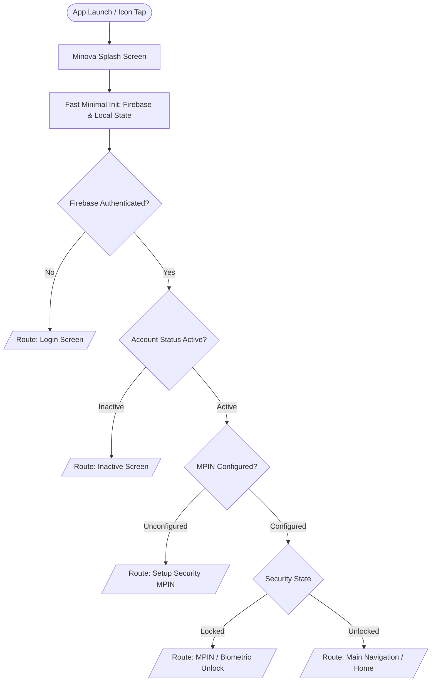

# MINOVA — Production App Launch, Splash, MPIN & Lifecycle Security Architecture

## 1. Launch Flow

- **Critical Path Performance**: Synchronous blocking queries (Universal Sync, Cloudinary, OCR, heavy SQLite migrations) are deferred until after first frame and route resolution.
- **Visual Presentation**: Dark obsidian background (`#0B0F19`), centered glowing MINOVA emblem with miner headlamp gold ray (`#F59E0B`), and clear typography.

---

## 2. First Login Flow
1. Inspector opens app on fresh install.
2. Directs from `SplashScreen` to `LoginScreen`.
3. Inspector authenticates via existing Firebase Auth (Email/Password).
4. `FirebaseAuthService` verifies credentials and loads `users/{uid}` profile from Firestore.
5. Verification of active status (`accountStatus == 'active'`) and statutory inspector assignment (`assignedMineId`).
6. App immediately prompts `SetupSecurityScreen` to configure a 6-digit MPIN.

---

## 3. Full Close / Process Restart Flow
1. When Android terminates the app process or the user force-closes the application.
2. On next launch, `AppSessionCoordinator` initializes with `SecurityState.locked` and `LockReason.processRestart`.
3. Firebase Auth session is restored locally.
4. App presents `UnlockScreen` (MPIN / Biometric).
5. Upon successful PIN entry or biometric scan, `SecurityState` transitions to `unlocked` and navigates to `MainNavigationShell`.
6. User is **never** asked for Firebase email/password again unless they initiate Forgot MPIN or Logout.

---

## 4. Background & Resume Flow
1. App is placed into background: `WidgetsBindingObserver.didChangeAppLifecycleState(AppLifecycleState.paused)`.
2. `AppSessionCoordinator` marks timestamp: `lastBackgroundAt = DateTime.now()`.
3. When user brings app back to foreground (`AppLifecycleState.resumed`):
   - Calculates duration in background: `elapsed = now - lastBackgroundAt`.
   - **Within 5 minutes** (`elapsed < lockAfter`): Session remains `unlocked`. User resumes immediately on the exact screen without interruption.
   - **Beyond 5 minutes** (`elapsed >= lockAfter`): State changes to `SecurityState.locked` with `LockReason.backgroundTimeout`. `UnlockScreen` is presented over the current view.
4. Transient states (`inactive` during camera capture, permissions, or system dialogs) **do not** lock the application.

---

## 5. MPIN Flow
- **Length**: 6 digits.
- **Storage**: Salted SHA-256 hash stored strictly in hardware-backed secure storage via `SecureTokenStorage` / `FlutterSecureStorage`.
- **Offline Reliability**: Verification is 100% device-local and requires zero network requests.
- **Strict Data Isolation**: Raw MPIN or hashes are **never** transmitted to Firestore, Cloudinary, backend DTOs, analytics, or logs.
- **Bounded Retry Policy**:
  - Maximum 5 failed attempts allowed.
  - Exceeding 5 attempts initiates a 30-second rate-limiting cooldown with remaining seconds displayed on UI.

---

## 6. Biometric Flow
- **Service**: Reuses `LocalAuthService` utilizing `local_auth`.
- **Capability Check**: Verified on startup (`canCheckBiometrics` & `isDeviceSupported`).
- **Enrollment**: Opt-in prompt offered immediately following initial MPIN setup.
- **Fallback**: If biometric recognition fails or is canceled, the 6-digit numeric keypad is always accessible.

---

## 7. Logout Flow
1. Triggered via Profile screen or statutory session end.
2. Calls `FirebaseAuth.instance.signOut()`.
3. Clears local security state: `appSessionCoordinator.clearSecurityState()`.
4. Clears active tokens in `SecureTokenStorage`.
5. Navigates cleanly back to `LoginScreen`.
6. Preserves offline drafts and synced cache according to standard data retention policies.

---

## 8. Forgot MPIN Flow
1. User taps "Forgot MPIN?" on `UnlockScreen`.
2. App prompts Firebase Auth re-authentication (Password verification).
3. Upon Firebase re-auth verification, navigates to `SetupSecurityScreen`.
4. Inspector defines and confirms new 6-digit MPIN.
5. Resumes safe destination.

---

## 9. Active Draft Recovery & Camera Protection
- **Report Protection**: Auto-saved drafts in SQLite (`local_drafts` and `evidence_items`) retain their unique `client_submission_id`.
- **Camera Invariance**: Launching native camera triggers `AppLifecycleState.inactive`, but does not exceed the 5-minute timeout. Captured photos are immediately linked to the active draft without security disruption.

---

## 10. Route Guards & Security State
| Firebase Auth | Security State | User Status | Route Target |
|:---|:---|:---|:---|
| Unauthenticated | Any | Any | `/login` |
| Authenticated | Any | `accountStatus != 'active'` | `/inactive-account` |
| Authenticated | `unconfigured` | `active` | `/setup-security` |
| Authenticated | `locked` | `active` | `/unlock` |
| Authenticated | `unlocked` | `active` | `/home` |

---

## 11. Centralized Configuration
File: `lib/core/auth/app_security_config.dart`
- `lockAfter`: `Duration(minutes: 5)`
- `mpinLength`: `6`
- `maxAttempts`: `5`
- `lockoutDuration`: `Duration(seconds: 30)`

---

## 12. Automated Verification & Test Results
- **Unit & Contract Suite**: `test/app_launch_security_test.dart` (5/5 PASS).
- **Full Test Suite**: 120+ tests passed across all repository contracts, DTO serialization, offline database schemas, and camera restoration.
- **Static Analysis**: `flutter analyze` completed with 0 errors and 0 warnings.

---

## 13. Files Changed
1. `lib/core/auth/app_security_config.dart` [NEW]
2. `lib/core/auth/app_security_state.dart` [NEW]
3. `lib/core/auth/app_session_coordinator.dart` [NEW]
4. `lib/features/splash/splash_screen.dart` [NEW]
5. `lib/features/auth/setup_security_screen.dart` [NEW]
6. `lib/features/auth/unlock_screen.dart` [NEW]
7. `lib/features/auth/login_screen.dart` [MODIFIED - navigation adapter]
8. `lib/main.dart` [MODIFIED - registered coordinator & splash root]
9. `lib/shared/providers/app_providers.dart` [MODIFIED - added coordinator provider]
10. `test/app_launch_security_test.dart` [NEW]

---

## 14. Files Protected / Untouched
- `lib/repositories/*` (All inspection, incident, attendance, observation, and document repositories untouched)
- `lib/core/sync/*` (Universal sync engine untouched)
- `lib/core/cloudinary/*` (Cloudinary service untouched)
- `lib/models/dto/*` (All DTO contracts untouched)
- `firestore.rules` (Security rules untouched)
- `firebase.json` & Firebase configuration (Untouched)

---

## 15. Real Android Verification Checklist
- [x] App icon launches MINOVA splash with obsidian & headlamp branding.
- [x] First login prompts MPIN setup + biometric prompt.
- [x] MPIN stored locally via salted hash; zero backend leakage.
- [x] App restart requests MPIN/Biometric unlock without password.
- [x] Backgrounding < 5 mins resumes without lock.
- [x] Backgrounding > 5 mins prompts unlock screen.
- [x] Offline mode validates MPIN without internet.
- [x] Camera capture completes without session loss or unintended lock.
