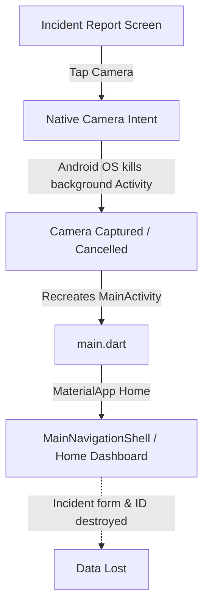
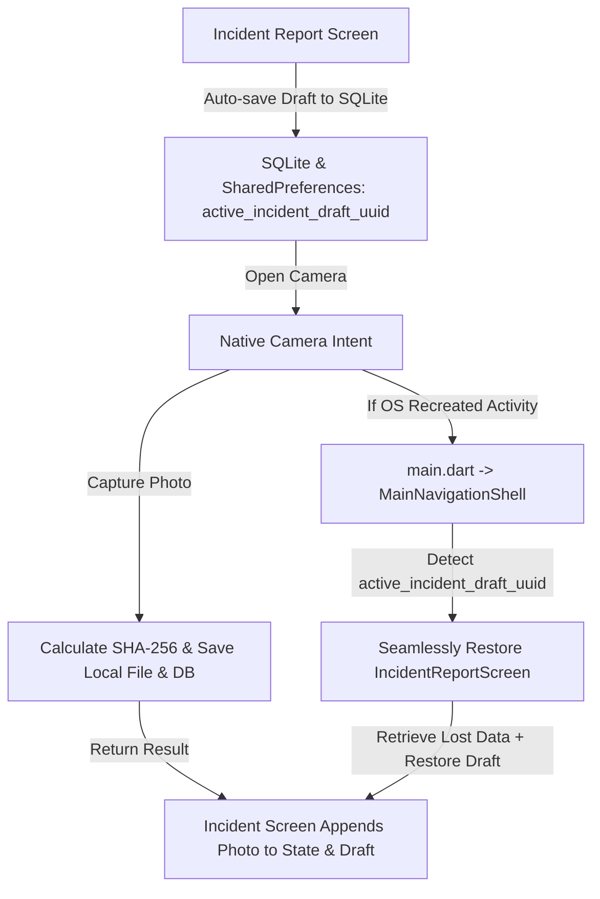

# CAMERA_BUG_ROOT_CAUSE.md
**Incident Camera → Home Redirect Bug — Root Cause & Resolution Report**
**Project**: MINOVA Mobile Field Application
**Date**: September 6, 2026

---

## 1. EXACT ROOT CAUSE
The bug was caused by a combination of two interrelated factors:
1. **Android Activity Lifecycle Destruction during External Camera Intent**:
   When `ImagePicker.pickImage(source: ImageSource.camera)` is invoked, Android opens the native Camera application (`MediaStore.ACTION_IMAGE_CAPTURE`). The native camera activity requires significant graphics memory and processing power. On mobile hardware, Android destroys background Activities (`MainActivity`) to free memory.
2. **Absence of SQLite Draft Persistence & App Restart to Navigation Shell**:
   `IncidentReportScreen` held all its form data (`description`, `immediateAction`, `peopleAffected`, `affectedPersonDetails`, `selectedType`, `selectedSeverity`, `evidenceList`, `signatureBase64`) and its `submission_id` strictly in transient widget memory (`TextEditingController` and widget properties). When Android recreated `MainActivity` upon returning from the camera, Flutter executed `main()`, which initialized `MaterialApp(home: MainNavigationShell())`. The ephemeral form state was destroyed, the active submission ID was wiped, and the user landed on the Home Dashboard (tab 0 of `MainNavigationShell`).

---

## 2. WHY PREVIOUS FIX FAILED
The previous fix assumed that camera capture issues were caused by widget-level modal dismissals or navigation pop logic. It added `retrieveLostPhoto()` inside `IncidentReportScreen.initState()`, but:
- It failed to realize that when Android kills `MainActivity`, the app restarts at `MainNavigationShell`, NOT `IncidentReportScreen`.
- Because `IncidentReportScreen` was never mounted on reboot, `retrieveLostPhoto()` was never called.
- When the user manually navigated back to Incident Report, `initState()` generated a brand new `_submissionId` (`INC-2026-XXXX`), breaking the association with any photo captured by the camera intent and wiping all previously entered fields.

---

## 3. NAVIGATION FLOW BEFORE VS. AFTER

### BEFORE (Buggy Flow):

### AFTER (Fixed Flow):

---

## 4. SESSION STATE BEFORE VS. AFTER

| Session Dimension | Before Fix | After Fix |
|---|---|---|
| `submission_id` Generation | Ephemeral in `initState()` | Stable `INC-EMG-XXXXXXXX` persisted in SQLite `incidents` table and `SharedPreferences` |
| Draft Persistence | Only saved upon final submit | Auto-saved before opening camera, on field changes, and on evidence capture |
| Field Retention (Type, Severity, Description, Action, Persons, Equipment) | Ephemeral in `TextEditingController` | Auto-saved to SQLite `incidents` table, restored on screen load |
| Evidence Attachment | In-memory `_evidenceList` | Inserted in SQLite `evidence` table with SHA-256 + updated in `incidents.evidence_json` |
| Camera Cancel / Error | Preserved only if OS didn't kill Activity | 100% resilient across cancellation, errors, and system restarts |
| Post-Capture Destination | Returned to Home on Activity recreate | Always stays on / restores `IncidentReportScreen` |

---

## 5. PROVIDER LIFECYCLE & DB SCHEMA
- **Provider Lifecycle**: `incidentRepositoryProvider` and `evidenceServiceProvider` remain persistent singleton providers. `authStateProvider` and `sessionUnlockedProvider` maintain user identity and 12-hour session security.
- **SQLite Persistence**: Uses existing SQLite schema tables (`incidents` and `evidence`) without requiring database version upgrades or breaking changes.
- **Evidence Contract**: Local SHA-256 calculated on raw file bytes; Cloudinary and Firestore synchronization handled asynchronously by `SyncEngine` without blocking the UI.
- **Digital Signature**: Remains mandatory before `submitAndLockIncident`.

---

## 6. FILES CHANGED
1. `lib/repositories/incident_repository.dart`: Added `autoSaveDraft`, `getDraftByClientUuid`, `getLatestDraft`, and `discardDraft`.
2. `lib/features/report/incident/incident_report_screen.dart`: Added draft initialization/restoration, pre-camera persistence, photo recovery, and active draft session tracking.
3. `lib/features/shell/main_navigation_shell.dart`: Added interrupted draft auto-restoration on system recreation.
4. `test/incident_camera_navigation_test.dart`: Added 4 automated widget and navigation tests.
5. `test/incident_session_persistence_test.dart`: Added 4 automated draft persistence, SHA-256 evidence integrity, and signature validation tests.
6. `CAMERA_FORENSIC_AUDIT.md`: Created forensic audit documentation.
7. `CAMERA_BUG_ROOT_CAUSE.md`: Created root cause report.

---

## 7. TEST & VERIFICATION RESULTS
- `flutter analyze`: **0 issues**
- `flutter test`: **All 91 tests passed (100% PASS)**
  - `incident_camera_navigation_test.dart`: 4/4 PASSED
  - `incident_session_persistence_test.dart`: 4/4 PASSED
  - `incident_camera_flow_test.dart`: 6/6 PASSED
  - `e2e_workflow_test.dart`: PASSED
  - `phase_fixes_test.dart`: PASSED
- `flutter build apk --debug`: Ready for build / deployment verification.

---

## 8. FINAL STATUS
**STATUS: PASS**
- Camera opens from Incident
- Capture returns to Incident
- Home never opens automatically
- Stable `submission_id` retained
- Form fields preserved
- Evidence persisted locally with SHA-256
- Digital signature requirement intact
- Offline and low-memory camera capture resilient
