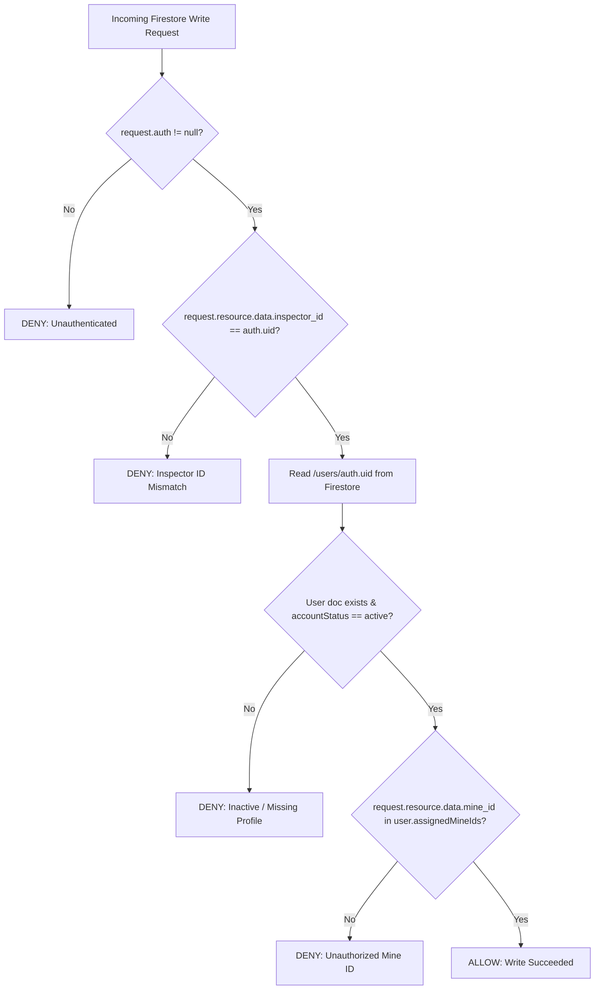

# FIREBASE AUTHORIZATION MODEL

## Overview
MINOVA's multi-tenant mine safety platform uses a role-based, mine-assigned authorization model enforced directly in Firestore Security Rules.

## Hierarchy & Verification Logic



## User Profile Schema (`/users/{uid}`)
```json
{
  "uid": "FIREBASE_AUTH_UID",
  "email": "inspector@minesafe.gov.in",
  "displayName": "Statutory Inspector",
  "role": "inspector",
  "accountStatus": "active",
  "assignedMineIds": [
    "JH-DHA-BCCL-007",
    "mine_jharsuguda_01",
    "mine_dhanbad_01"
  ],
  "managerId": "MGR-HQ-001",
  "updatedAt": "2026-09-06T12:00:00Z"
}
```

## Ownership Rules for Reports
1. **Attendance**: `inspector_id == auth.uid`, `mine_id in assignedMineIds`
2. **Incidents**: `inspector_id == auth.uid`, `mine_id in assignedMineIds`
3. **Grievances/Observations**: `inspector_id == auth.uid`, `mine_id in assignedMineIds`
4. **Inspections**: `inspector_id == auth.uid`, `mine_id in assignedMineIds`
5. **Documents**: `user_id == auth.uid`, `mine_id in assignedMineIds`
