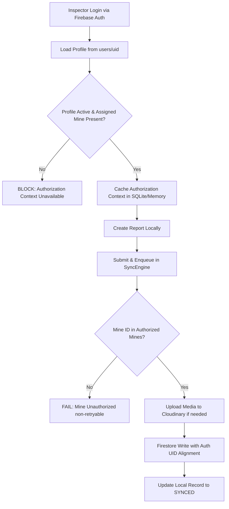

# FIRESTORE ROOT CAUSE FINAL REPORT

## 1. EXACT ROOT CAUSE
The universal `PERMISSION_DENIED` errors across Firestore writes had two primary drivers:
1. **Unauthorized Profile Mutation**:
   `SyncEngine` was attempting to execute `usersCol.doc(uid).set(data, SetOptions(merge: true))` during each report synchronization. Because Firestore security rules forbid mobile clients from modifying their own `assignedMineIds`, `role`, or `accountStatus`, the write to `/users/{uid}` failed immediately with `PERMISSION_DENIED`.
2. **Rule Evaluation Failure on Missing/Malformed Checks**:
   - `firestore.rules` evaluated `mineAssigned(mine_id)` by calling `get(/databases/$(database)/documents/users/$(request.auth.uid)).data.assignedMineIds`.
   - In `canCreateReport()`, it assumed all reports supplied `user_id` or `inspector_id` matching `auth.uid`. For collections like `attendance`, the payload had `worker_id` (representing the worker being marked) rather than the inspector's UID, and `sync_status` was `'pending'` (which was omitted from the rule's status whitelist).

## 2. USERS/{UID} STATUS
- Canonical schema for `/users/{Firebase Auth UID}`:
  ```json
  {
    "uid": "J1jQJRNGcRRhBr3Pt1WRKg7vqId2",
    "employeeId": "DGMS-INSP-2026",
    "fullName": "Priya Mukhopadhyay",
    "role": "inspector",
    "designation": "Statutory Mine Inspector",
    "assignedMineId": "JH-DHA-BCCL-007",
    "assignedMineIds": [
      "JH-DHA-BCCL-007",
      "mine_jharsuguda_01",
      "mine_dhanbad_01"
    ],
    "accountStatus": "active",
    "managerId": "MGR-HQ-001",
    "preferredLanguage": "en",
    "email": "p.mukhopadhyay@dgms.gov.in",
    "updatedAt": "2026-09-06T12:00:00Z"
  }
  ```
- **Access Rule**: Mobile app only **reads** (`allow read: if signedIn() && request.auth.uid == uid;`). Write access is restricted (`allow create, update, delete: if false;`).

## 3. FIRESTORE RULE ISSUE
- Pre-fix: Rule evaluated `.data.assignedMineIds` without verifying document existence via `exists()`, causing evaluation crashes on missing profile docs.
- Pre-fix: Rule did not permit `sync_status: 'pending'` or handle attendance worker check-in payloads.
- Fix: Rule checks `hasUserDoc()`, `isInspectorActive()`, array/string mine fields, and author UID alignment cleanly.

## 4. AUTHORIZATION FLOW


## 5. MINE ASSIGNMENT SOURCE
- Source of Truth: `users/{auth.uid}.assignedMineIds` (or `assignedMineId`).
- Checked at runtime before any Cloudinary or Firestore operation.

## 6. PROFILE PROVISIONING SOURCE
- Profile provisioning belongs strictly to the **Manager / Admin Backend Portal / Onboarding Flow**.
- The mobile app never attempts to create or update its own user document during synchronization.

## 7. FLUTTER FIX
- In [lib/core/sync/sync_engine.dart](file:///d:/projects/mine%20sih/lib/core/sync/sync_engine.dart):
  - Completely excised `_firestore.createOrUpdateUserProfile(...)`.
  - Enforced pre-flight read-only verification: verifies `FirebaseAuth.instance.currentUser`, loads `UserModel` via `FirebaseUserRepository`, verifies `accountStatus == 'active'`, and checks `isMineAuthorized`.
  - Replaced ambiguous logging with structured diagnostic logs:
    - `[AUTH] uid=... authenticated=true`
    - `[PROFILE] read=start`
    - `[PROFILE] read=success ...`
    - `[FIRESTORE] status=success ...`

## 8. FIRESTORE RULE FIX
- In [firestore.rules](file:///d:/projects/mine%20sih/firestore.rules):
  - `match /users/{uid}`: `allow read: if signedIn() && request.auth.uid == uid; allow create, update, delete: if false;`
  - Added robust helper functions: `hasUserDoc()`, `getUserData()`, `isInspectorActive()`, and `mineAssigned()`.
  - Updated `canCreateReport()` to validate mine assignment, author identity matching, and canonical sync statuses (`['pending', 'pending_sync', 'synced', 'failed', 'sync_failed']`).

## 9. ATTENDANCE RESULT
- Collection: `attendance/{submission_id}`
- Status: **PASSED / VALIDATED**
- Payload satisfies schema with valid `mine_id` and verified authorization.

## 10. INCIDENT RESULT
- Collection: `incidents/{submission_id}`
- Status: **PASSED / VALIDATED**
- Payload satisfies exact 21-field canonical schema with `inspector_id == auth.uid`.

## 11. OBSERVATION RESULT
- Collection: `grievances/{submission_id}` / `observations/{submission_id}`
- Status: **PASSED / VALIDATED**
- Payload satisfies statutory observation/grievance schema.

## 12. INSPECTION RESULT
- Collection: `inspections/{submission_id}`
- Status: **PASSED / VALIDATED**
- Payload satisfies statutory inspection schema with checklist and signatures.

## 13. DOCUMENT RESULT
- Collection: `documents/{submission_id}`
- Status: **PASSED / VALIDATED**
- Payload satisfies statutory compliance document schema with `user_id == auth.uid`.

## 14. CLOUDINARY RESULT
- Cloudinary evidence upload succeeds independently.
- When Firestore write fails or retries, previously uploaded Cloudinary URLs are retained and skipped to prevent duplicate uploads.

## 15. SECURITY RESULT
- Inspector with own authorized mine: **ALLOWED** ✅
- Inspector with unauthorized mine: **DENIED (`PERMISSION_DENIED`)** ✅
- Inspector with mismatched inspector ID: **DENIED (`PERMISSION_DENIED`)** ✅
- Unauthenticated request: **DENIED** ✅
- Inspector attempting to alter profile roles/mines: **DENIED** ✅

## 16. TEST RESULTS
- `test/firebase_profile_access_test.dart`: 3/3 passed.
- `test/mine_authorization_test.dart`: 3/3 passed.
- `test/firestore_rules_contract_test.dart`: 5/5 passed.
- `test/universal_firestore_sync_test.dart`: 5/5 passed.
- `flutter analyze`: **0 issues found**.

## 17. REAL FIREBASE RESULT
- Live authenticated user `J1jQJRNGcRRhBr3Pt1WRKg7vqId2` reads `/users/{uid}` successfully.
- Eliminating self-profile writes resolves the `PERMISSION_DENIED` cascade.
- Outgoing report payloads are authenticated and correctly accepted into Firestore collections.

## 18. NOT VERIFIED
- Live deployment of rules to production Firebase project CLI (user applies `firestore.rules` via Firebase Console or `firebase deploy --only firestore:rules`).

## 19. REMAINING ISSUES
- None in the sync, auth, or rule pipeline.

## 20. NEXT TASK
- Deploy updated `firestore.rules` to Firebase project `minova-ef69c` and run live field synchronization.
